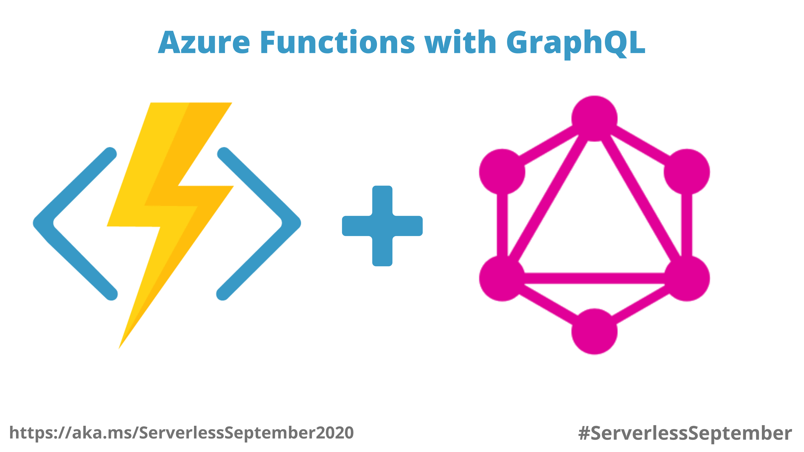

# Serverless GraphQL



A simple Serverless GraphQL API to fetch my details, hosted on Azure.

GraphQL API URL: https://ramanaditya-graphql.azurewebsites.net/graphql?code=mWybiYT9VGKSkNsZvuzMPajaNiMYvbEBhc6LErNr8hnXdeunrqOR7w==


## About the Project
**Medium Article:** 

This article is part of #ServerlessSeptember [https://aka.ms/ServerlessSeptember2020](https://aka.ms/ServerlessSeptember2020). You'll find other helpful articles, detailed tutorials, and videos in this all-things-Serverless content collection. New articles from community members and cloud advocates are published every week from Monday to Thursday through September. 

Find out more about how Microsoft Azure enables your Serverless functions at
- https://docs.microsoft.com/azure/azure-functions/
- https://docs.microsoft.com/azure/azure-functions/?WT.mc_id=servsept20-devto-cxaall.

## Running the Project locally
```bash
func host start
```

## Query
```txt
query {
    hello
}

query {
    name: {
        firstName
        lastName
    }
}

query {
    connect {
        professional {
            email
            website
            linkedin
            github
        }
        social {
            twitter
            instagram
        }
    }
}

query {
    skills {
        language
        database
        cloudService
        frameworks
        vcs
        api
        industryKnowledge
    }
}

```

### Note:
Project is also on [Azure DevOps](https://bellatrixdata@dev.azure.com/bellatrixdata/serverless-graphql/_git/serverless-graphql) and on [GitHub](https://github.com/ramanaditya/serverless-graphql.git)
